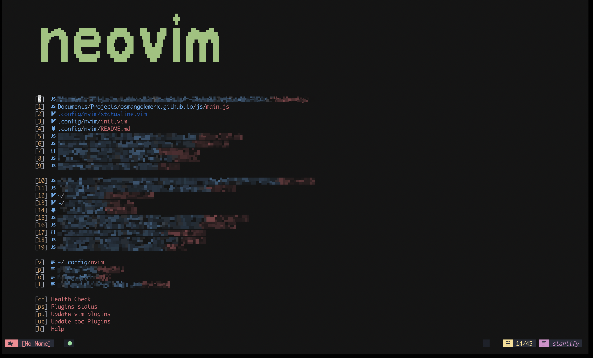
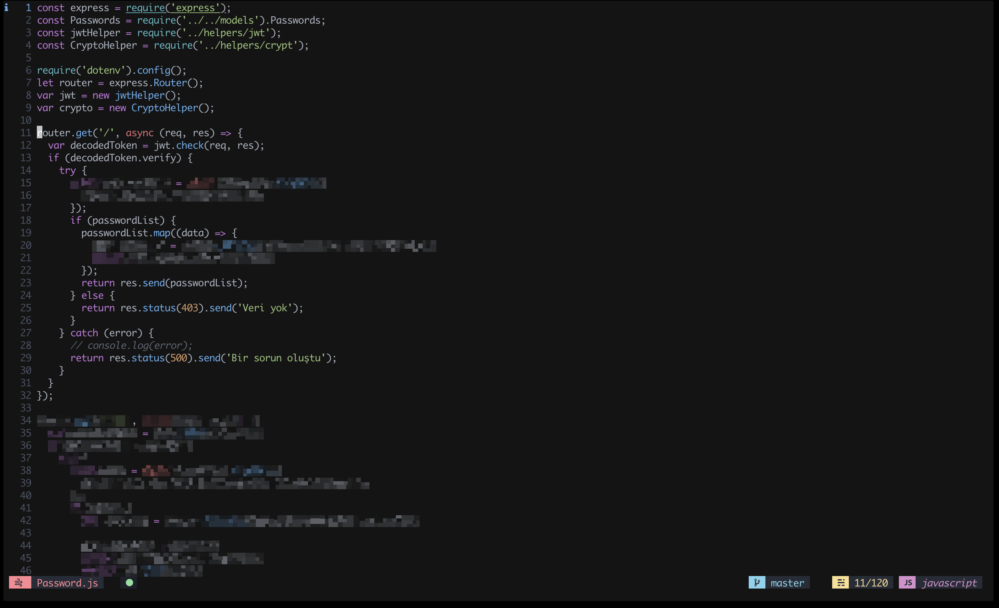

    
    

## Features

- Single file (you don't want your dotfiles to be all Vim script)
- Super fast startup (less than 40ms!)
- Lazy loading plugins
- Highly customizable
- Beautiful [One Dark](https://github.com/osmangokmenx/onedark.vim)
  color scheme
- Various IDE features via [coc.nvim](https://github.com/neoclide/coc.nvim)
- Fully integrated with fzf
- Live Markdown preview
- Simple, Intuitive shortcuts

### Supported Languages

Neovim provides support for a wide range of languages by default. For more
languages install [vim-polyglot](https://github.com/sheerun/vim-polyglot).

## Requirements

- Linux, MacOS (not tested on other platforms)
- Neovim

## Setup

To check if your current environment is correctly set up run `:CheckHealth`.

### Environment

- python3: `pip3 install --user pynvim`
- javascript: `yarn global add neovim`

### Tools

- [Any patched nerd font](https://github.com/ryanoasis/nerd-fonts/)
- [tmux](https://github.com/tmux/tmux) (not required but recommended)
- [prettier](https://prettier.io/)
- [fuzzy finder (fzf)](https://github.com/junegunn/fzf)
- [NERDTree](https://github.com/preservim/nerdtree)
- [ripgrep](https://github.com/BurntSushi/ripgrep)
- [bat](https://github.com/sharkdp/bat)
- [black](https://black.readthedocs.io/en/latest/) for python formatting

## Installation

After installing the requirements:

- `git clone https://github.com/osmangokmenx/init.nvim ~/.config/nvim`
- Start `nvim` and it will do the rest
- press enter if there are any errors (don't worry its fine)

## Plugins

Thanks to vim-plug the plugins are lazy loaded (anything that is not needed for
the current buffer is not loaded) for example opening a python file means all
other non python related plugins are not loaded. Coc extensions are lazy loaded
as well, they work the same way as vim-plug plugins.

| Plugin                                                              | Functionality                                |
| ------------------------------------------------------------------- | -------------------------------------------- |
| [vim-airline](https://github.com/vim-airline/vim-airline)           | airline status line                          |
| [devicons](https://github.com/ryanoasis/vim-devicons)               | icons everywhere                             |
| [rainbow](https://github.com/luochen1990/rainbow)                   | rainbow parenthesis                          |
| [vim-material](https://github.com/hzchirs/vim-material)             | material themes                              |
| [coc.nvim](https://github.com/neoclide/coc.nvim)                    | async completion and more                    |
| [fzf.vim](https://github.com/junegunn/fzf.vim)                      | fuzzy finder vim integration                 |
| [vim-snippets](https://github.com/honza/vim-snippets)               | snippets for many languages                  |
| [indentLine](https://github.com/Yggdroot/indentLine)                | auto indent lines                            |
| [vim-commentary](https://github.com/tpope/vim-commentary)           | better comments everywhere                   |
| [vim-startify](https://github.com/mhinz/vim-startify)               | cool startup thingy                          |
| [vim-fugitive](https://github.com/tpope/vim-fugitive)               | best git integration around                  |
| [vim-sandwich](https://github.com/machakann/vim-sandwich)           | surround stuff with stuff                    |
| [vim-smoothie](https://github.com/psliwka/vim-smoothie)             | super smooth scrolling                       |
| [tmux-navigator](https://github.com/christoomey/vim-tmux-navigator) | seamless movement between Vim and tmux panes |
| [tmux-complete](https://github.com/wellle/tmux-complete.vim)        | tmux panes completion                        |
| [vim-eunuch](https://github.com/tpope/vim-eunuch)                   | some common Linux commands                   |
| [semshi](https://github.com/numirias/semshi)                        | better highlighting for python               |
| [markdown-preview](https://github.com/iamcco/markdown-preview.nvim) | live markdown preview                        |
| [vim-MvVis](https://github.com/Jorengarenar/vim-MvVis)              | move visual selection                        |

## Keyboard shortcuts

#### Essentials

| Mapping      | functionality                        |
| ------------ | ------------------------------------ |
| `;`          | commands key                         |
| `,`          | leader key                           |
| `leader + r` | reload nvim config                   |
| `leader + w` | save changes                         |
| `leader + e` | call :PlugInstall (install plug-ins) |
| `leader + ö` | Open NERDTree                        |
| `Enter`      | enter empty line in normal mode      |
| `F2`         | trim white spaces                    |
| `F6`         | open Startify                        |

#### Visual Mode Essentials

| Mapping    | functionality                   |
| ---------- | ------------------------------- |
| `ctrl + j` | move selected text to bottom    |
| `ctrl + k` | move selected text to top       |
| `ctrl + h` | move selected text to the left  |
| `ctrl + l` | move selected text to the right |

#### Navigation

`ctrl + hjkl` navigation also supports tmux panes.

| Mapping      | functionality                          |
| ------------ | -------------------------------------- |
| `leader + q` | close tab                              |
| `ctrl + q`   | close all buffers and exit             |
| `ctrl + l`   | move to the split on the right         |
| `ctrl + k`   | move the split above                   |
| `ctrl + j`   | move to the split on below             |
| `ctrl + h`   | move the split to the left             |
| `Tab`        | switch to the next buffer(normal mode) |
| `S-Tab`      | switch to the previous buffer          |

#### IDE Features

| Mapping       | functionality                        |
| ------------- | ------------------------------------ |
| `leader + o`  | organize imports                     |
| `leader + a`  | run cocAction on what's undercursor  |
| `leader + s`  | format file with available formatter |
| `leader + rn` | rename globally                      |
| `leader + jd` | jump to definition                   |
| `leader + jy` | jump to type definition              |
| `leader + ji` | jump to implementation               |
| `leader + jr` | jump to references                   |
| `ctrl + a`    | highlight for multi cursor selection |
| `shift + k`   | show current symbol documentation    |
| `]g`          | next diagnostic                      |
| `[g`          | Previous diagnostic                  |

#### Flutter

| Mapping | functionality                          |
| ------- | -------------------------------------- |
| `F3`    | show list of devices                   |
| `F4`    | show list of emulators                 |
| `F5`    | start development server (flutter run) |

#### FZF windows

| Mapping       | functionality                            |
| ------------- | ---------------------------------------- |
| `leader + f`  | files viewer                             |
| `leader + c`  | show editor commands                     |
| `leader + /`  | search in current folder files           |
| `leader + sh` | search / history                         |
| `leader + b`  | show open buffers                        |
| `leader + t`  | search current file tags                 |
| `F1`          | show keyboard shortcuts for current mode |

#### In FZF

these only work on an open fzf window

| Mapping | Functionality                 |
| ------- | ----------------------------- |
| `C-x`   | open file in horizontal split |
| `C-v`   | open file in vertical split   |
| `C-t`   | open file in new tab          |

#### Git

| Mapping       | functionality            |
| ------------- | ------------------------ |
| `leader + gd` | git diff split           |
| `leader + gc` | git commits              |
| `leader + gb` | git blame                |
| `leader + gs` | git status in fzf window |

## Custom commands

| Command | Functionality                            |
| ------- | ---------------------------------------- |
| Format  | format file with any available formatter |
| OR      | organize imports                         |
| Rg      | advanced Grep                            |

## Customizations

Since the file is pretty small its very easy to interpret by even those who
don't have any knowledge about vim script, most of the sections have comments
about their functionality, and can be removed, commented out or swapped easily,
there are some defaults that are not everyone's cup of tea (after all this is
highly opinionated).

- **Disabling Plugins:** comment out the plug's 'Plugin/name' line from config
  and also remove the plugin settings

- **Disabling CoC Plugins:** comment out the plugin from `coc_global_extensions`
  variable and uninstall it via `:CocUninstall` plugin name

- **Installing CoC plugins:** open `:CocList` and search for marketplace, you
  can find all available plugins here

- **Adding Bookmarks:** to add bookmarks to the start page, find
  `g:startify_bookmarks` in `init.nvim` and add the new bookmark just like the
  already present ones, the dictionary key is the shortcut you will use to
  quickly jump to that folder from the start page and the value is the path to
  targeted folder

Forked from [Blacksuan19](https://github.com/Blacksuan19/init.nvim)
